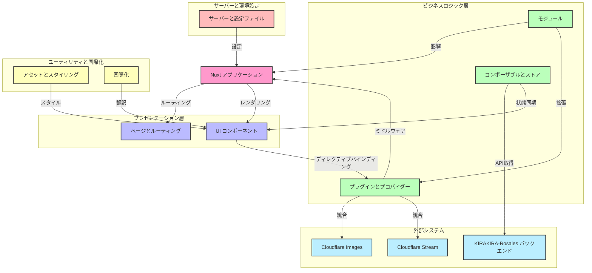

# プロジェクトコードネーム ｢<ruby>Cerasus<rp>（</rp><rt>[第13都市](https://zh.moegirl.org.cn/zh-hans/DARLING_in_the_FRANXX#cite_ref-10:~:text=%E7%AC%AC13%E9%83%BD%E5%B8%82%EF%BC%88Plantation%EF%BC%89%5B9%5D%E2%80%9C%E6%A8%B1%EF%BC%88Cerasus%EF%BC%89%E2%80%9D)</rt><rp>）</rp></ruby>｣
![State][state-shield]
![Tag][tag-shield]
[![LICENSE-BSD 3‐Clause][license-shield]][license-url]
![Commit Activity][commit-activity-shield]\
[![Contributors][contributors-shield]][contributors-url]
[![Forks][forks-shield]][forks-url]
[![Stargazers][stars-shield]][stars-url]
[![Issues][issues-shield]][issues-url]\
[![Simplified Chinese Translation][zh-cn-translation-shield]][zh-cn-translation-url]
[![Traditional Chinese Translation][zh-tw-translation-shield]][zh-tw-translation-url]
[![Japanese Translation][ja-translation-shield]][ja-translation-url]
[![Korean Translation][ko-translation-shield]][ko-translation-url]
[![Vietnamese Translation][vi-translation-shield]][vi-translation-url]
[![Indonesian Translation][id-translation-shield]][id-translation-url]
[![French Translation][fr-translation-shield]][fr-translation-url]
[![Cantonese Translation][yue-translation-shield]][yue-translation-url]

KIRAKIRA のフロントエンド

[简体中文](README.md) | [English](README_en-US.md) | **日本語**

[![Figma デザイン文稿][figma-design-shield]][figma-design-url]
[![Discord サーバー][discord-server-shield]][discord-server-url]

## スター履歴

<a href="https://star-history.com/#KIRAKIRA-DOUGA/KIRAKIRA-Cerasus&Date">
 <picture>
   <source media="(prefers-color-scheme: dark)" srcset="https://api.star-history.com/svg?repos=KIRAKIRA-DOUGA/KIRAKIRA-Cerasus&type=Date&theme=dark" />
   <source media="(prefers-color-scheme: light)" srcset="https://api.star-history.com/svg?repos=KIRAKIRA-DOUGA/KIRAKIRA-Cerasus&type=Date" />
   
 </picture>
</a>

## アーキテクチャ図



もっと詳しく知りたいですか？[Wikiを読む][deepwiki-url]！

## Nuxt

詳細については、[Nuxt ドキュメント](https://nuxt.com/)をご覧ください。

### セットアップ
このリポジトリをクローンするには、以下のコマンドまたはその他のGit互換ツールを使用できます。
```
git clone https://github.com/KIRAKIRA-DOUGA/KIRAKIRA-Cerasus.git
```

クローンが完了したら、プログラムのルートディレクトリで次のコマンドを実行して依存パッケージをインストールします。

```bash
pnpm install
```


### 開発サーバー
KIRAKIRA Cerasusの開発サーバーには、複数のモードがあります。\
ショートカットコマンドを使用して一般的な開発モードを起動したり、好みに応じて起動コマンドをカスタマイズしたりできます。

> [!IMPORTANT]
> 1. 一部の機能はHTTPSを有効にしないと正常に動作しません。KIRAKRIA Cerasusはデフォルトで[このパス](server/)にある自己署名証明書を使用します。初めてアクセスする際にブラウザに「このサイトは安全ではありません」という警告が表示されますが、これは正常な現象です。「そのまま進む」を選択してください。
> 2. ローカルの3000番ポートが他のアプリケーションやデバイスによって既に使用されている場合、開発サーバーは自動的にポート番号を3001に調整します。コンソールに出力される正しいURLを必ず確認してください。


#### ローカルバックエンドで実行

HTTPSをサポートする開発サーバーを起動し、**ローカル**のバックエンドAPIを使用します。

この方法で起動した開発サーバーは、ローカルのバックエンドAPIに接続します。生成されたデータはご自身で管理し、KIRAKIRAとは関係ありません。\
別途[KIRAKIRA-Rosales バックエンドサービス](https://github.com/KIRAKIRA-DOUGA/KIRAKIRA-Rosales)を実行する必要があります。そうしないと、プログラムは期待通りに動作しません。

キーボードで <kbd>Ctrl</kbd> + <kbd>Shift</kbd> + <kbd>B</kbd> を押し、`npm: dev local` を選択してください。

または、プログラムのルートディレクトリで次のコマンドを実行して起動することもできます：

```bash
pnpm dev-local
```

> [!WARNING]\
> ローカルバックエンドに接続していても、画像リソースファイルは公式のステージング環境のCloudflare Imagesサービスにリクエストされ、動画アップロード時には公式のステージング環境のCloudflare Streamサブドメインテンプレートが使用されます。独自のCloudflare ImagesおよびCloudflare Streamサービスを使用したい場合は、以下の「カスタム起動コマンド」セクションを参照してください。

> [!WARNING]\
> 本番環境へのアクセス権を持つ開発者は、`pnpm run dev-local-prod`コマンドを使用して、本番環境のCloudflare ImagesおよびCloudflare Streamサービスに接続することもできます。

起動後、このアドレスでアクセスできるはずです：https://localhost:3000/

#### オンラインバックエンドで実行

ローカルでフロントエンド開発サーバーを起動し、**オンライン**のバックエンドAPIに接続することができます。ローカルでバックエンドサービスを起動する必要はありません。\
KIRAKIRAには、**ステージング**環境と**本番**環境の2つのオンラインバックエンドがあります。ステージング環境にはテストデータと開発中の機能が含まれており、本番環境はあなたがアクセスするkirakira.moe公式サイトです。

**いずれにせよ、以下の使用制限を必ずお読みください：**

> [!WARNING]\
> **ステージング環境**のデモモードの使用制限：
> 1. ステージング環境のデモモードでは、開発チームメンバー以外のテスト、改ざん行為は乱用と見なされます。
> 2. ユーザーがステージング環境で生成したデータは、KIRAKIRA開発チームが使用することを許可し、取り消すことはできません。
> 3. ステージング環境の使用によって生じたいかなる人身上および財産上の損失についても、KIRAKIRAは一切責任を負いません。

> [!WARNING]\
> **本番環境**のデモモードの使用制限：
> 1. あなたはKIRAKIRAの公式オンライン環境とやり取りしており、KIRAKIRAの利用規約および免責事項が引き続き適用されます。

> [!NOTE]\
> 現在、デモモードではCookieのクロスドメイン問題があり、アカウントにログインできません。

**ステージング環境**のデモモードを起動するコマンドは次のとおりです：

```bash
pnpm dev-stg-demo
```

**本番環境**のデモモードを起動するコマンドは次のとおりです：

```bash
pnpm dev-live-demo
```

起動後、このアドレスでアクセスできるはずです：https://localhost:3000/


#### カスタム起動コマンド

プリセットのクイックスタートコマンドではニーズを満たせないことがよくあります。その場合、元の起動コマンドを使用してサーバーを起動し、カスタムパラメータを使用できます。

典型的なカスタム起動コマンドは次のようになります：
```bash
# 以下のコマンドは 'pnpm dev-local' と同等です
pnpm cross-env VITE_BACKEND_URI=https://localhost:9999 VITE_CLOUDFLARE_IMAGES_PROVIDER=cloudflare-stg VITE_CLOUDFLARE_STREAM_CUSTOMER_SUBDOMAIN=https://customer-o9xrvgnj5fidyfm4.cloudflarestream.com/ nuxi dev --host --https --ssl-cert server/server.cer --ssl-key server/server.key
```

起動後、このアドレスでアクセスできるはずです：https://localhost:3000/

上記のコマンドの解析：
1. `cross-env`\
  クロスプラットフォームの環境変数を設定し、コマンドが異なるオペレーティングシステム（WindowsやLinuxなど）で正常に実行されるようにします。
2. `VITE_BACKEND_URI=https://localhost:9999`\
  `VITE_BACKEND_URI` という名前の環境変数を注入し、その値を `https://localhost:9999`（バックエンドAPIのURI）に設定します。
3. `VITE_CLOUDFLARE_IMAGES_PROVIDER=cloudflare-stg`\
  `VITE_CLOUDFLARE_IMAGES_PROVIDER` という名前の環境変数を注入し、その値を `cloudflare-stg` に設定します。\
  これは、`cloudflare-stg` という名前の [NuxtImage Custom Provider](https://image.nuxt.com/advanced/custom-provider) を使用していることを示します。\
  NuxtImage Custom Providerの設定を変更するには、ルートディレクトリの `nuxt.config.ts` ファイルの `image.providers` セクションに移動してください。
4. `VITE_CLOUDFLARE_STREAM_CUSTOMER_SUBDOMAIN=https://custom...stream.com/`\
  `VITE_CLOUDFLARE_STREAM_CUSTOMER_SUBDOMAIN` という名前の環境変数を注入し、その値を `https://custom...stream.com/` に設定します。\
  この環境変数は、Cloudflare Streamサービスのカスタムサブドメインを指定します。
5. `nuxi dev`\
  Nuxtの開発サーバーを起動します。オプションのパラメータについては、[この公式ドキュメント](https://nuxt.com/docs/api/commands/dev)を参照してください。
6. `--host`\
  `--host` の後にパラメータが指定されていない場合、開発サーバーはすべてのホストをリッスンします。詳細については、以下の「モバイルウェブページのテストとプレビュー」セクションを参照してください。
7. `--https --ssl-cert server/server.cer --ssl-key server/server.key`\
  `--https` はHTTPSを有効にすることを示します。`--ssl-cert XXX.cer --ssl-key YYY.key` は証明書のパスを指定します。


#### モバイルウェブページのテストとプレビュー

開発サーバーを起動する際、`--host` パラメータを指定しないか、値を指定しないか、`0.0.0.0` に設定してください。

スマートフォン/タブレットがコンピュータと同じローカルエリアネットワーク内にあることを確認し（条件が許さない場合はホットスポットを開いてください）、モバイルデバイスのQRコードスキャナーでコンソールに表示されるQRコードをスキャンしてアクセスしてください。

または、モバイルブラウザで開発サーバーホストのIPアドレスにアクセスすることもできます。例：[https://192.168.\*.\*:3000/](https://192.168.*.*:3000/) 。通常、このアドレスは開発サーバーを起動した後にコンソールに出力されます。

> [!NOTE]\
> **WindowsホストでIPを照会する方法：**<wbr /><kbd>Win</kbd> + <kbd>R</kbd>を押し、`cmd`と入力してコマンドプロンプトを開き、`ipconfig`と入力して現在のコンピュータのIPアドレスを照会します。

### 本番

#### 本番向けにアプリケーションを生成する

これにより、すべての静的ルートページが完全に生成されます。

キーボードで <kbd>Ctrl</kbd> + <kbd>Shift</kbd> + <kbd>B</kbd> を押し、`npm: generate` を選択してください。

```bash
pnpm generate
```

#### 本番向けにアプリケーションをビルドする

これにより、最小限のルートページのみがビルドされます。

キーボードで <kbd>Ctrl</kbd> + <kbd>Shift</kbd> + <kbd>B</kbd> を押し、`npm: build` を選択してください。

```bash
pnpm build
```

#### 本番ビルドをローカルでプレビューする

```bash
pnpm preview
```

> [!IMPORTANT]\
> 本番モードで実行する場合、接続されるバックエンドサービスインターフェースは https://rosales.kirakira.moe/ です。\
> このとき、あなたはオンライン環境とやり取りすることになります。\
> これは、公式サイトやアプリを通じてKIRAKIRAサービスを利用するのと何ら変わりなく、この場合でもKIRAKIRAの利用規約および免責事項が適用されます。

詳細については、[デプロイメントドキュメント](https://nuxt.com/docs/getting-started/deployment)を参照してください。

## その他のスクリプト機能

メニューの *ターミナル(<ins>T</ins>) > タスクの実行...* を順に選択すると、その他のスクリプト機能にアクセスできます。

### StyleLintのチェック

```bash
npm: lint:css
```

### イージング値のスタイル *(_eases.scss)* 宣言ファイルを更新

これにより、`_eases.scss` ファイルの変更に基づいて `eases.module.scss` と `eases.module.scss.d.ts` の2つの追加ファイルが自動的に更新されます。

```bash
npm: update-eases
```

### SVGの圧縮

これにより、SVGが圧縮され、トリミング領域や塗りつぶしの色など、SVGの余分な部分が削除されます。

```bash
Compact SVG
```

## カスタムディレクティブ（シンタックスシュガー）

このプロジェクトでは、開発者が使いやすいように、さまざまな機能、豆知識、さらには下位レベルのコードの変更などを利用して、多くのシンタックスシュガーを追加しています。

### リップル効果

`v-ripple` カスタムディレクティブを使用して、マテリアルデザインのリップル効果を素早く作成します。これは、リップル効果を有効にするかどうかを示すブール値を受け取ります。空のままにすると、自動的に有効になります。

```html
<!-- 直接有効にする -->
<div v-ripple>
<!-- 明示的に有効にする -->
<div v-ripple="true">
<!-- foo変数の値に応じて有効にする -->
<div v-ripple="foo">
```

### アニメーションの優先順位

各項目が順番に表示されるアニメーション（具体的なアニメーションは手動で実装する必要があります）を実現したい場合は、`v-i` カスタムディレクティブを使用してください。これは、優先順位を示す数値を受け取ります。0から始まるか1から始まるかは、アニメーションの実装によって決まります。

```html
<div v-i="1">
```

これは次のように変換されます：

* Vue SFC 構文
  ```vue
  <div :style="{ '--i': 1 }">
  ```
* JSX 構文
  ```jsx
  <div style={{ '--i': 1 }}>
  ```
* HTML 構文
  ```html
  <div style="--i: 1;">
  ```

### ツールチップ

ネイティブの醜い `title` 属性を置き換えることを目的とした、カスタムツールチップを作成するには `v-tooltip` を使用します。

```html
<!-- ツールチップの方向を自動的に決定する -->
<div v-tooltip="'素早い茶色のキツネは怠惰な犬を飛び越える'">
<!-- ツールチップの方向を明示的に指定する -->
<div v-tooltip:top="'素早い茶色のキツネは怠惰な犬を飛び越える'">
<!-- ツールチップを高度に設定する -->
<div v-tooltip="{
    title: '素早い茶色のキツネは怠惰な犬を飛び越える', // ツールチップのテキスト
    placement: 'top', // 4つの方向を指定
    offset: 10, // ツールチップと要素の間の距離
}">
```

### ローカライゼーション

このプロジェクトのローカライゼーションに関する提案をしたい場合は、[Issue](https://github.com/KIRAKIRA-DOUGA/KIRAKIRA-Cerasus/issues)を投稿してお知らせください。このプロジェクトにローカライゼーションで貢献したい場合は、[プルリクエスト](https://github.com/KIRAKIRA-DOUGA/KIRAKIRA-Cerasus/pulls)を投稿してください。ありがとうございます！\
Please post an [Issue](https://github.com/KIRAKIRA-DOUGA/KIRAKIRA-Cerasus/issues) to let us know you would like to provide some localization suggestions to this project; Please post an [Pull Request](https://github.com/KIRAKIRA-DOUGA/KIRAKIRA-Cerasus/pulls) to contribute localization to this project. Thank you!

> [!IMPORTANT]\
> **注意：**<wbr />翻訳辞書ファイルの各識別子はスネークケース（アンダースコア記法）を使用する必要があります。また、複数の言語間で文字列の宣言が多かったり少なかったりするとエラーが発生します。つまり、見落としを防ぐために、これらの言語に同時に完全な文字列宣言を指定する必要があります。

プロジェクトは、Vue-i18nのネイティブ翻訳関数を強化し、使いやすくしています。

<table>
<thead>
<th>機能</th>
<th>現在の強化構文</th>
<th>元の構文</th>
</thead>
<tbody>
<tr>
<td>直接宣言</td>
<td>

```typescript
t.welcome
```

</td>
<td>

```typescript
$t("welcome")
```

</td>
</tr>
<tr>
<td>変数宣言</td>
<td>

```typescript
t[variable]
```

</td>
<td>

```typescript
$t(variable)
```

</td>
</tr>
<tr>
<td>位置引数</td>
<td>

```typescript
t.welcome("hello", "world")
```

</td>
<td>

```typescript
$t("welcome", ["hello", "world"])
```

</td>
</tr>
<tr>
<td>名前付き引数</td>
<td>

```typescript
t.welcome({ foo: "hello", bar: "world" })
```

</td>
<td>

```typescript
$t("welcome", { foo: "hello", bar: "world" })
```

</td>
</tr>
<tr>
<td>複数形</td>
<td>

```typescript
t(2).car
```

</td>
<td>

```typescript
$tc("car", 2)
```

</td>
</tr>
</tbody>
</table>

### コンポーネントのルートノード

各コンポーネントの要素の境界をより明確にし、スタイルの漏洩などの問題を回避するために、プロジェクトでは `<Comp>` をコンポーネントのルートノードとして使用してください。

コンポーネント名が `TextBox.vue` であると仮定します：

```html
<Comp />
```

これは自動的に次のようにコンパイルされます：

```html
<kira-component class="text-box"></kira-component>
```

同時に、スタイルシートでは `:comp` を使用して、コンポーネントのルートノードをより便利に参照できます。

```css
:comp {

}
```

これは自動的に次のようにコンパイルされます：

```css
kira-component.text-box {

}
```

さらに、他の場所でこのコンポーネントを呼び出すときに、コンポーネントの名前に基づいてスタイルを設定できるため、余分なクラス名を追加する必要はありません。

### タッチスクリーンでの `:hover` 擬似クラスの無効化

ご存知のように、マウスにはホバー機能があります。マウスカーソルをボタンの上に置くと、ボタンは `:hover` 擬似クラスで表されるスタイルに反応します。しかし、タッチスクリーンは指で操作するため、「ホバー」機能は存在しません。ブラウザは、いわゆる「ホバー」機能を実現するために、ボタンをタッチすると、非表示のカーソルをそのボタンの上に配置して「ホバー」スタイル状態を表現します。指が画面から離れてもカーソルは消えず、ボタンはホバースタイルのままです。これはユーザーにとって奇妙に感じられ、ユーザーはそのボタンのホバースタイルを消すために他の空白部分をクリックする必要があります。これは私たちが望むものではありません。

プロジェクトでは、元の `:hover` 擬似クラスを `:any-hover` 擬似クラスに置き換えてください。これにより、ユーザーがマウスカーソルで操作した場合にのみホバースタイルが表示され、タッチスクリーンではホバースタイルがトリガーされません。さらに、タッチスクリーンには `:hover` スタイルがないため、タッチスクリーンユーザーにより良い体験を提供するために、必ず `:active` スタイルを設定してください。

```css
button:any-hover {

}
```

これは自動的に次のようにコンパイルされます：

```css
@media (any-hover: hover) {
    button:hover {

    }
}
```

> [!NOTE]\
> `@media (any-hover: hover)` ルールに加えて、`@media (hover: hover)` ルールもあります。それらの違いは、`hover` は主要な入力デバイスがホバー機能をサポートしているかどうかのみを検出し、`any-hover` は少なくとも1つの入力デバイスがホバー機能をサポートしているかどうかを検出する点です。

### メニュー、フライアウトなどの双方向バインディングモデルパラメータ

* メニューコンポーネントの `v-model` にマウス/ポインターイベント `MouseEvent` / `PointerEvent` を渡すことで、対応する位置にメニューを表示します。`null` を渡すとコンテキストメニューではなくプレースホルダーメニューが表示され、`undefined` を渡すとメニューが非表示になります。

* フライアウトコンポーネントの `v-model` にタプル（推奨）またはオブジェクトを渡すと、フライアウトが表示されます。`undefined` を渡すとフライアウトが非表示になります。
  * オブジェクトの書き方：
    ```typescript
    {
        target: MouseEvent | PointerEvent; // マウス/ポインターイベント
        placement?: "top" | "bottom" | ...; // 4つの方向を指定
        offset?: number; // ツールチップと要素の間の距離
    }
    ```
  * タプルの書き方
    ```typescript
    [target, placement?, offset?]
    ```

### スタイル関連のコンポーネントProp

`<SoftButton>` コンポーネントを例にとると、Propでボタンのサイズをカスタマイズできないことに驚くかもしれません。ボタンのサイズは固定なのでしょうか？

そうではありません。`<LogoCover>` コンポーネントも同様に、Propでカバーのサイズを設定できません。

正しい方法は、スタイルシートで以下の方法（カスタムプロパティ）を使用して設定することです：

```scss
.soft-button {
    --wrapper-size: 40px;
}
```

これでスタイルが完璧に適用されます。

さらに、ブール型または列挙型もサポートしています。

```scss
.logo-text {
    --form: full;
}

.tab-bar {
    --clipped: true;
}
```

結局のところ、スタイルを設定するなら、HTML/templateで個別に設定するよりもCSS/SCSSで一括設定する方が良いのではないでしょうか？

## IDE

開発には以下のいずれかのプラットフォームを使用することをお勧めします：

[](https://code.visualstudio.com/)\
[](https://www.jetbrains.com/webstorm/)\
[](https://www.sublimetext.com/)\
[](https://www.jetbrains.com/fleet/)

<details>
<summary>使用しないでください</summary>

<!-- * EditPlus -->
* Atom
* Dreamweaver
* SharePoint
* FrontPage
* Notepad++
* HBuilder
* HBuilderX
* Vim
* メモ帳
* ワードパッド
* Word
</details>

## 使用技術
フロントエンド開発で使用されている技術スタックは次のとおりです：

[](https://nuxt.com/)
[](https://vuejs.org/)
[](https://vitejs.dev/)
[](https://pinia.vuejs.org/)
[](https://www.typescriptlang.org/)
[](https://sass-lang.com/)
[](https://github.com/css-modules/css-modules)
[](https://postcss.org/)
[](https://webpack.js.org/)
[](https://developer.mozilla.org/zh-CN/docs/Web/Progressive_web_apps)
[](https://airbnb.design/lottie/)
[](https://m3.material.io/)
[](https://developer.microsoft.com/en-us/fluentui)
[](https://eslint.org/)
[](https://stylelint.io/)
[](https://editorconfig.org/)
[](https://nodejs.org/)
[](https://www.npmjs.com/)
[](https://git-scm.com/)
[](https://www.figma.com/)
[![KIRAKIRA](https://img.shields.io/badge/-KIRAKIRA☆DOUGA-F06E8E?style=flat-square&logo=data:image/svg+xml;base64,PHN2ZyB3aWR0aD0iMjAxIiBoZWlnaHQ9IjIwMSIgZmlsbD0ibm9uZSIgdmVyc2lvbj0iMS4xIiB2aWV3Qm94PSIwIDAgMjAxIDIwMSIgeG1sbnM9Imh0dHA6Ly93d3cudzMub3JnLzIwMDAvc3ZnIj4KCTxwYXRoIGQ9Im02My45ODQgMTEuMTI3Yy04LjAzNzItMC4xMTU4Mi0xNC4wODggMy40NTUzLTE0LjY0MSAxMy4wNy0wLjAwNjcgMC4xMTYxIDAuMDA4NTA2IDAuMjMzMzEgMC4wMDM5MDYgMC4zNDk2MS0wLjExMzgtMC4wMzE5LTAuMjI1NTQtMC4wNzU1NjktMC4zMzk4NC0wLjEwNTQ3LTUuMDE1Ny0xLjMxNjktOC44NTQ4LTAuNTc3MDYtMTEuNzAzIDEuNTg1OS0xMC4xNjYgNy43MTk5LTcuNjc4MyAzMy41NTktMC43NSA0OC42NTYtMTguNTM3IDEwLjQxOS00MS41NDUgMzkuMzY4LTE5LjQ2NSA0Ny45NzMgMC4xMDg0IDAuMDQyIDAuMjI0NzggMC4wNjQ0NyAwLjMzMzk4IDAuMTA1NDctMC4wNjU1IDAuMDk4LTAuMTQxMzggMC4xOTAwNi0wLjIwNTA4IDAuMjg5MDYtMi44MDI0IDQuMzY0LTMuMjg0MyA4LjI0MzEtMi4xMDc0IDExLjYyMSA0LjE5OTEgMTIuMDQ5IDI5LjUyNCAxNy42NjggNDYuMDIzIDE1Ljc1IDQuMTk1MiAyMC44NDkgMjQuNjA1IDUxLjYzNCAzOS42MDQgMzMuMzAzIDAuMDczLTAuMDkgMC4xMzExMy0wLjE5NDE2IDAuMjAzMTMtMC4yODUxNiAwLjA3MyAwLjA5MiAwLjEzNzg5IDAuMTk0MTYgMC4yMTI4OSAwLjI4NTE2IDMuMjg0IDQuMDEzIDYuODI0NCA1LjY3MTcgMTAuNCA1LjU5NTcgMTIuNzUzLTAuMjY5NjMgMjUuOTE5LTIyLjYwMyAyOS4xOTktMzguODg3IDE2LjUwMiAxLjg3NzUgNDEuNzEyLTMuNzQyMiA0NS45LTE1Ljc2MiAxLjE3Ny0zLjM3OCAwLjY5NTU3LTcuMjU3MS0yLjEwNzQtMTEuNjIxLTAuMDYzLTAuMDk5LTAuMTQwMDgtMC4xOTEwNi0wLjIwNTA4LTAuMjg5MDYgMC4xMDktMC4wNDEgMC4yMjQ5OC0wLjA2MzQ3IDAuMzMzOTgtMC4xMDU0NyAyMi4wNzgtOC42MDM4LTAuOTIyNjMtMzcuNTQ3LTE5LjQ1OS00Ny45NjkgOC44NzEzLTE5LjMyNiAxMC40NjctNTYuMjYzLTEyLjQ1MS01MC4yNDYtMC4xMTI5OSAwLjAyOTUtMC4yMTkwMyAwLjA3OTkyOC0wLjMzMjAzIDAuMTExMzMtNWUtMyAtMC4xMTc5IDAuMDAyMS0wLjIzNzg3LTAuMDAzOS0wLjM1NTQ3LTAuMjk4LTUuMTc3My0yLjE4Ny04LjYwMDEtNS4xMjUtMTAuNjQxLTEwLjQ1OC03LjI2NTQtMzQuMTczIDMuMDE4Ni00Ni40MTYgMTQuMjQyLTkuMjk1Ny04LjUyMjEtMjUuMjA0LTE2LjUwMy0zNi45MDQtMTYuNjcyem0zNi45MDIgMTYuODY5YzkuMzY3OCA3LjA1OTcgMTQuMDExIDQxLjEyNyAxMy43MDkgNDguNjA3IDcuMDQ0Mi0yLjYwNzEgNDEuMTA1LTguNzQwMiA1MC41ODQtMS45MDQzLTMuNjQ5MyAxMS4xMDItMzQuODExIDI2LjE2Mi00Mi4wNDMgMjguMTkzIDQuNjUyNSA1Ljg4NzIgMjAuOTg1IDM2LjMwNiAxNy40NTcgNDcuNDYxLTExLjczNy0wLjI0MDkxLTM1LjQ4NS0yNS4wMzktMzkuNjM1LTMxLjI2NC00LjE2NDYgNi4yNDYyLTI4LjA5MSAzMS4yMDEtMzkuNzg1IDMxLjI3MS0zLjUzNzktMTEuMTQ4IDEyLjgwMi00MS41OCAxNy40NTUtNDcuNDY5LTcuMjMwNy0yLjAzMTEtMzguMzg2LTE3LjA4OC00Mi4wNDEtMjguMTg5IDkuNDcxMS02Ljg0MjMgNDMuNTI0LTAuNjkzOSA1MC41NyAxLjkxNDEtMC4zMDE1NS03LjQ4MDMgNC4zNjA1LTQxLjU2MSAxMy43MjktNDguNjIxeiIgZmlsbD0iI2ZmZiIvPgo8L3N2Zz4K&logoColor=white)](https://www.kirakira.moe/)

## テスト用ブラウザ
[](https://www.google.cn/chrome/index.html)\
[](https://www.microsoft.com/edge/download)\
[](https://www.mozilla.org/firefox/new)\
[](https://www.opera.com/)\
[](https://www.apple.com/safari/)

## フォーマット仕様
* **インデント：**<wbr />TAB
* **行末：**<wbr />LF
* **引用符：**<wbr />ダブルクォーテーション
* **ファイルの末尾**に空行を追加
* **文の末尾**にセミコロンを追加
* **Vue API スタイル：**<wbr />コンポジション

## 貢献者

[](https://github.com/KIRAKIRA-DOUGA/KIRAKIRA-Cerasus/graphs/contributors)

<!-- MARKDOWN LINKS & IMAGES -->
<!-- https://www.markdownguide.org/basic-syntax/#reference-style-links -->
[state-shield]: https://img.shields.io/badge/STATE-ALPHA-red?style=flat-square
[tag-shield]: https://img.shields.io/badge/TAG-0.0.0-orange?style=flat-square
[license-shield]: https://img.shields.io/badge/LICENSE-BSD%203‐Clause-green?style=flat-square
[license-url]: https://github.com/KIRAKIRA-DOUGA/KIRAKIRA-Cerasus/blob/develop/LICENSE
[commit-activity-shield]: https://img.shields.io/github/commit-activity/y/KIRAKIRA-DOUGA/KIRAKIRA-Cerasus?label=COMMIT-ACTIVITY&style=flat-square

[contributors-shield]: https://img.shields.io/github/contributors/kIRAKIRA-DOUGA/KIRAKIRA-Cerasus.svg?label=CONTRIBUTORS&style=flat-square
[contributors-url]: https://github.com/kIRAKIRA-DOUGA/KIRAKIRA-Cerasus/graphs/contributors
[forks-shield]: https://img.shields.io/github/forks/kIRAKIRA-DOUGA/KIRAKIRA-Cerasus.svg?label=FORKS&style=flat-square
[forks-url]: https://github.com/kIRAKIRA-DOUGA/KIRAKIRA-Cerasus/network/members
[stars-shield]: https://img.shields.io/github/stars/kIRAKIRA-DOUGA/KIRAKIRA-Cerasus.svg?label=STARS&style=flat-square
[stars-url]: https://github.com/kIRAKIRA-DOUGA/KIRAKIRA-Cerasus/stargazers
[issues-shield]: https://img.shields.io/github/issues/kIRAKIRA-DOUGA/KIRAKIRA-Cerasus.svg?label=ISSUES&style=flat-square
[issues-url]: https://github.com/kIRAKIRA-DOUGA/KIRAKIRA-Cerasus/issues

[zh-cn-translation-shield]: https://img.shields.io/badge/dynamic/json?color=blue&label=简体中文&style=flat-square&logo=crowdin&query=%24.progress.6.data.translationProgress&url=https%3A%2F%2Fbadges.awesome-crowdin.com%2Fstats-14133121-613305.json
[zh-cn-translation-url]: https://crowdin.com/project/kirakira/zh-CN
[zh-tw-translation-shield]: https://img.shields.io/badge/dynamic/json?color=blue&label=繁體中文&style=flat-square&logo=crowdin&query=%24.progress.7.data.translationProgress&url=https%3A%2F%2Fbadges.awesome-crowdin.com%2Fstats-14133121-613305.json
[zh-tw-translation-url]: https://crowdin.com/project/kirakira/zh-TW
[ja-translation-shield]: https://img.shields.io/badge/dynamic/json?color=blue&label=日本語&style=flat-square&logo=crowdin&query=%24.progress.2.data.translationProgress&url=https%3A%2F%2Fbadges.awesome-crowdin.com%2Fstats-14133121-613305.json
[ja-translation-url]: https://crowdin.com/project/kirakira/ja
[ko-translation-shield]: https://img.shields.io/badge/dynamic/json?color=blue&label=한국인&style=flat-square&logo=crowdin&query=%24.progress.3.data.translationProgress&url=https%3A%2F%2Fbadges.awesome-crowdin.com%2Fstats-14133121-613305.json
[ko-translation-url]: https://crowdin.com/project/kirakira/ko
[vi-translation-shield]: https://img.shields.io/badge/dynamic/json?color=blue&label=Tiếng%20Việt&style=flat-square&logo=crowdin&query=%24.progress.4.data.translationProgress&url=https%3A%2F%2Fbadges.awesome-crowdin.com%2Fstats-14133121-613305.json
[vi-translation-url]: https://crowdin.com/project/kirakira/vi
[id-translation-shield]: https://img.shields.io/badge/dynamic/json?color=blue&label=Bahasa%20Indonesia&style=flat-square&logo=crowdin&query=%24.progress.1.data.translationProgress&url=https%3A%2F%2Fbadges.awesome-crowdin.com%2Fstats-14133121-613305.json
[id-translation-url]: https://crowdin.com/project/kirakira/id
[fr-translation-shield]: https://img.shields.io/badge/dynamic/json?color=blue&label=Français&style=flat-square&logo=crowdin&query=%24.progress.0.data.translationProgress&url=https%3A%2F%2Fbadges.awesome-crowdin.com%2Fstats-14133121-613305.json
[fr-translation-url]: https://crowdin.com/project/kirakira/fr
[yue-translation-shield]: https://img.shields.io/badge/dynamic/json?color=blue&label=粵語&style=flat-square&logo=crowdin&query=%24.progress.5.data.translationProgress&url=https%3A%2F%2Fbadges.awesome-crowdin.com%2Fstats-14133121-613305.json
[yue-translation-url]: https://crowdin.com/project/kirakira/yue

[figma-design-shield]: https://img.shields.io/badge/设计文稿-white?style=for-the-badge&logo=figma&logoColor=white&label=figma&labelColor=F24E1E
[figma-design-url]: https://www.figma.com/file/S5mM7zW5iMo560xnQ4cmbL/KIRAKIRA-Douga-PC?node-id=0%3A1
[discord-server-shield]: https://dcbadge.limes.pink/api/server/https://discord.gg/uVd9ZJzEy7
[discord-server-url]: https://discord.gg/uVd9ZJzEy7
[deepwiki-url]: https://deepwiki.com/KIRAKIRA-DOUGA/KIRAKIRA-Cerasus
